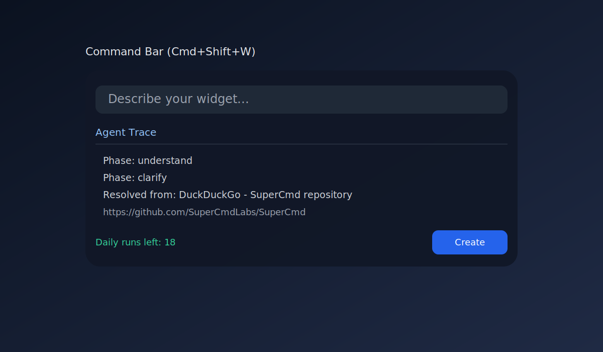
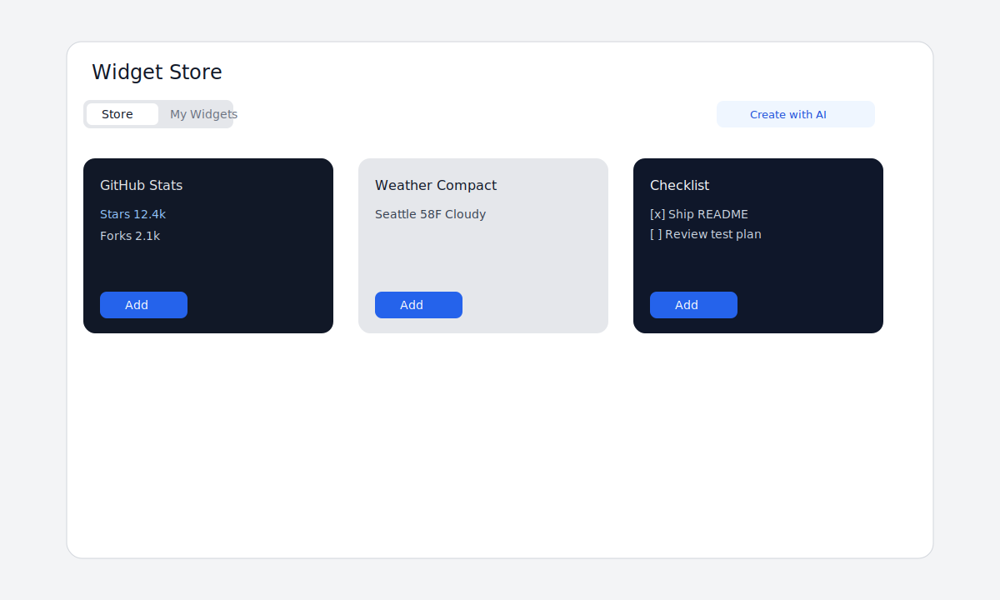
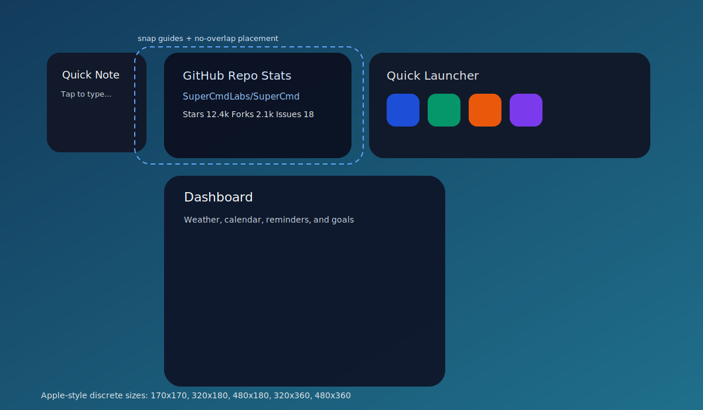
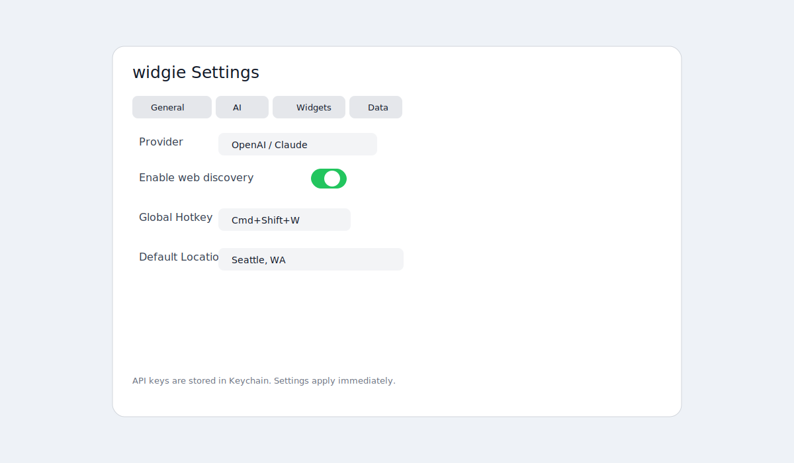
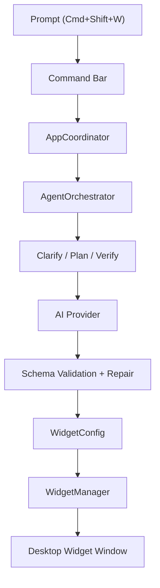

# widgie

`widgie` is a macOS menu bar app that lets you create desktop widgets by describing them in plain English.

Press `Cmd+Shift+W`, type what you want, and `widgie` turns that prompt into a live widget on your desktop background.

## What It Does

- Creates widgets from natural language prompts.
- Supports clocks, weather, stocks, crypto, reminders, calendars, notes, checklists, habits, launchers, news, system stats, GitHub widgets, and more.
- Lets you edit an existing widget by prompting again.
- Runs as a background-style menu bar app with a global hotkey.
- Persists widgets and interactive state across launches.

## How It Works

`widgie` combines two systems:

1. A native macOS widget runtime for layout, sizing, drag/resize, locking, persistence, and desktop placement.
2. An AI generation pipeline that interprets prompts, asks follow-up questions when needed, validates output, and repairs low-quality results before rendering.

## Screens

### Command Bar



### Widget Gallery



### Desktop Widgets



### Settings



## Features

### Prompt-to-widget

- Open the command bar with `Cmd+Shift+W`.
- Press `Cmd+Shift+W` again to close it.
- Press `Esc` to dismiss it.
- Ask for a widget in natural language.
- Get clarification questions when your request is ambiguous.

### Widget types

- Time and date widgets
- Weather widgets
- Stock and crypto widgets
- Calendar and reminders widgets
- Notes and checklist widgets
- Habit and productivity widgets
- Quick launch and bookmarks widgets
- Music, news, and system stats widgets
- GitHub repo widgets

### Native desktop behavior

- Apple-style size presets
- Drag and snap positioning
- Auto layout across screens
- Locking, duplication, deletion, and prompt-based editing
- Background launch support

## Example Prompts

- `make a weather widget for Seattle that refreshes every 10 minutes`
- `build a compact system monitor for cpu, ram, and battery`
- `create a checklist for my morning routine`
- `add a quick launcher with Safari, Notion, and Terminal`
- `track stars for owner/repo`

## Getting Started

### Requirements

- macOS
- Xcode
- An OpenAI or Claude API key

### Run Locally

1. Open [pane.xcodeproj](/Users/elicepriyadarshini/Desktop/pane/pane/pane.xcodeproj).
2. Select the `widgie` scheme.
3. Build and run the app.
4. Open `Settings...` from the menu bar.
5. Add at least one AI provider key.
6. Press `Cmd+Shift+W` and create your first widget.

## Command Bar Commands

- `/list`
- `/remove <name>`
- `/theme <obsidian|frosted|neon|paper|transparent>`
- `/layout auto`
- `/templates`
- `/template <name>`
- `/export`
- `/import`
- `/settings`

## Data Sources

Built-in providers currently include:

- Weather
- Stocks
- Crypto
- Battery
- System stats
- Music now playing
- RSS news
- Screen time
- GitHub repository stats
- Calendar
- Reminders

## Notes

- Calendar and Reminders may require macOS permissions.
- Music integration is designed to avoid force-launching Music unexpectedly.
- Some external services are represented through supported native data models rather than generic arbitrary HTTP fetches.

## Architecture



## Tests

Unit and UI tests live in:

- `paneTests/`
- `paneUITests/`

Run the app build from Terminal:

```bash
xcodebuild -project pane.xcodeproj -scheme widgie -configuration Debug -destination "platform=macOS,arch=arm64" build
```

Run the real AI end-to-end pipeline suite:

```bash
PANE_RUN_E2E_AI_TESTS=1 \
OPENAI_API_KEY="$OPENAI_API_KEY" \
OPENAI_MODEL="gpt-4o" \
OPENAI_VERIFICATION_MODEL="gpt-4o-mini" \
xcodebuild -project pane.xcodeproj -scheme widgie -configuration Debug -destination "platform=macOS,arch=arm64" -derivedDataPath /tmp/pane-build -only-testing:paneTests/PipelineE2ETests test
```
